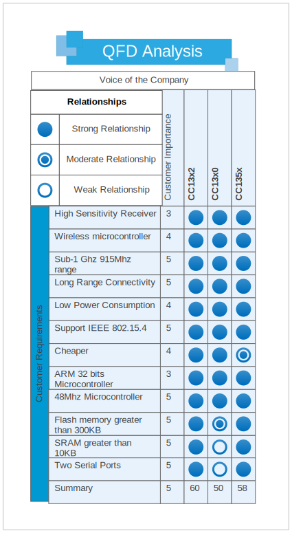
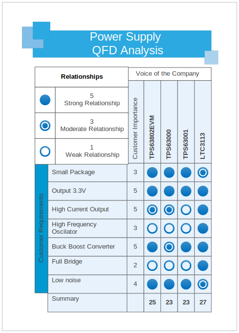
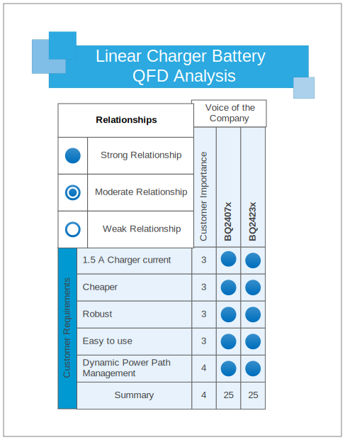
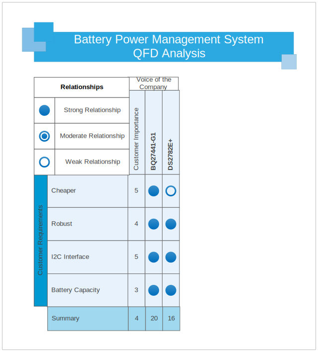

# 6. Locha Mesh Hardware 
 
This section presents the parameters that were used to choose all the control and transmission devices currently used in Locha Mesh. 

## 6.1 Radio frequency module 

To choose the radio module that contains the microcontroller (MCU), the RF and modulation needed to transmit on the Sub-GHz ISM band some parameters were established:

- Support of IEEE 802.15.4 standard
- At least 2 UART ports
- Affordable
- Easy to use 
- Support for the Sub-GHz ISM band

The chart shows three MCU's families with RF interface according to the criteria based on the current demand, choosing the CC1312R1 as the most economical, solid, with wide range coverage and low consumption module to perform the task  that the Turpial requires as a transceptor device. 

The MCUs family CC135X fulfills most of the requirements, nevertheless, provides more functions than required, increasing its value and consequently discarded.

## 6.2 Voltage source

For the Locha Mesh's Turpial to work optimally, the device that will regulate the voltage deriving from the battery and will power the device must be carefully selected. 

The parameters to take into account for the selection of the device that supplies the circuit are: 
- Electric current: the circuit current must be greater or equal to 2 amps (A). 
- Voltage: the device must be capable of delivering a stable 3.3 volts output voltage, regardless of whether the input supply is above or below the required threshold. 
- High efficiency: it must be efficient converting the energy, which translates into no external overheating.
- Noise: any noise in the voltage output signal can affect the entire system. 

When weighting the difference devices, it is observed that the LTC3113 provides a good performance, it is full bridge and delivers currents above 2.5 A, but it's high-priced. We have decided to use the TPS63802 since it provides the benefits required to meet the goals of our project, it has wide market availability and has an affordable price.  

## 6.3 Battery charger

For charging the lithium battery we have decided to use the BQ2407x family chip, which is easy to acquire and it adapts to the linear load and durability requirements of the batteries by having a robust charging system like the one presented in the Turpial design.

## 6.4 Battery power control 

The power control is the system that is responsible for reading variables related to the battery such as available power, charging time, current supplied, etc. 

When selecting the device that will perform this task, it must have I2C support, in the chart you can see two different devices from two different manufacturers, which have similar presentations but differ greatly in cost per unit, so The BQ27441-G1 will be used as a device for collecting battery related data to be sent to the main control unit.

## 6.5 WiFi Interface

For the selection of the WiFi interface, we have focused on the  _Espressif_ controllers, as this is a brand that offers a variety of devices with incredible features such as Bluetooth and Wi-Fi at very low cost, which another brand could hardly offer in addition to the extensive documentation that exist for this device. 

Benefits of the ESP32 family:
- WiFi, AP, STA and APSTA modes
- Economical.
- Extensive documentation available.
- Incorporate BLE, which enables a wide range of possibilities. 

Locha Mesh specifically works with ESP32 WROVER but also supports WROOM versions, consist of:
- 4 Mb Flash SPI.
- 8 Mb PSRAM.
- 80 MHz a 240 MHz Frequency. 
- Wi-Fi.
- Bluetooth.
- UART x3.
- Dual core.

It is perfect for the Turpial, as it has several UART ports, which allows us to communicate with the radio module and the PC via USB. It also allows us to implement a web server as a configuration interface.

## 6.6 Block diagram of the Turpial hardware 

## 6.7 Overview of the Turpial as a device.

The figure shows the first prototype currently under development. 
