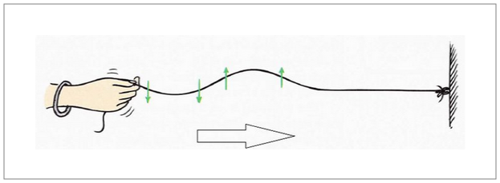
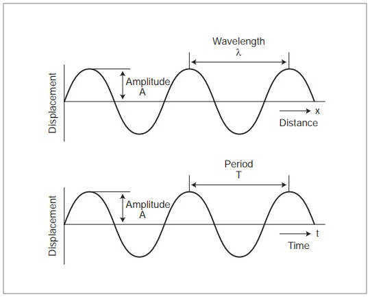
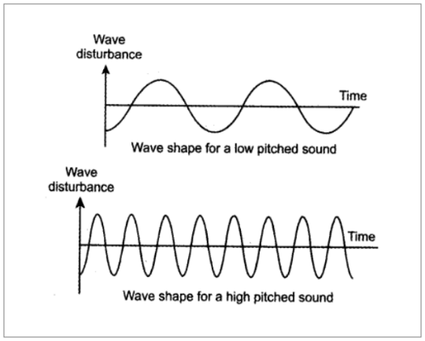
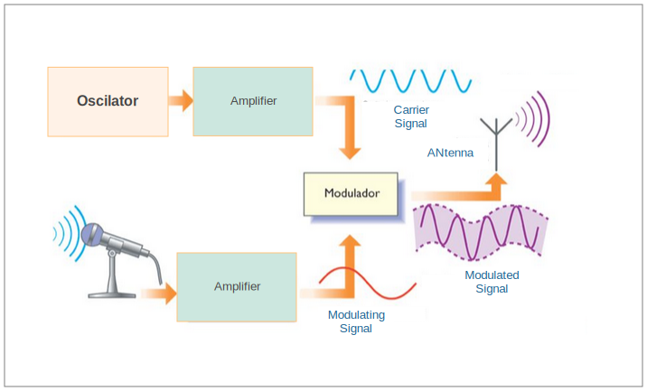
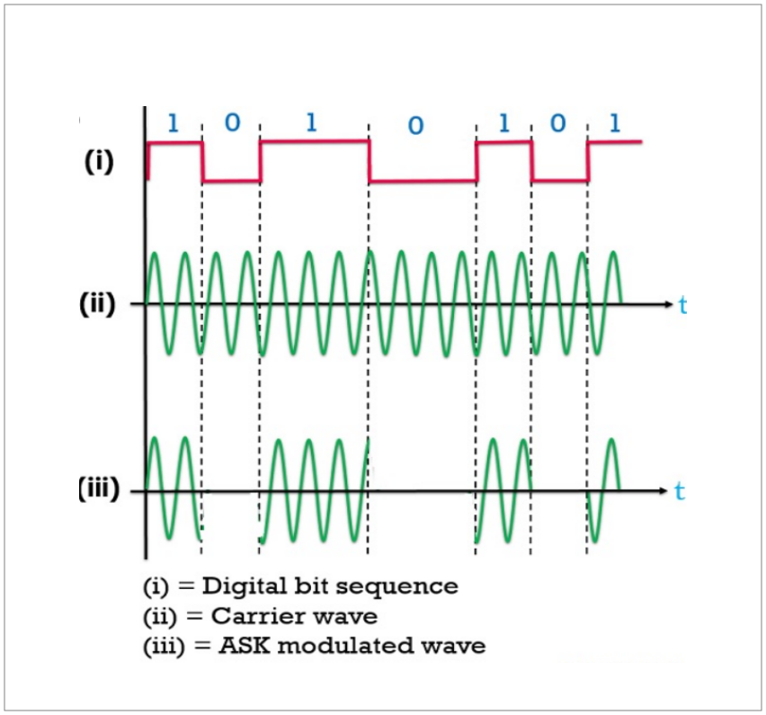
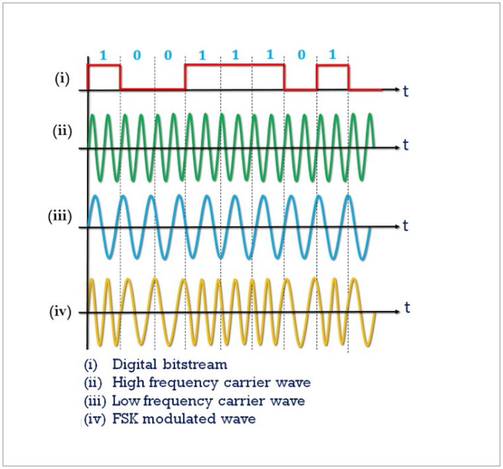

[Waves, Modulators and some signal theory](#waves)
  - [1 Characteristics of a wave](#1-caracteristicas-de-una-onda)
    - [Amplitude (A)](#111-amplitud-a)
    - [Frequency (f)](#112-frecuencia-f)
    - [Period (T)](#113-periodo-de-tiempo-t)
    - [Length (λ)](#114-longitud-de-onda-%ce%bb)
    - [Velocity (v)](#115-velocidad-v)
  - [2 Wave classification](#2-clasificaci%c3%b3n-de-las-ondas)
    - [2.1 Depending on the propagation medium](#21-en-funci%c3%b3n-del-medio-en-el-que-se-propagan)
      - [Mechanical Waves](#211-ondas-mec%c3%a1nicas)
      - [Electromagnetic waves](#212-ondas-electromagn%c3%a9ticas)
      - [Gravitational waves](#213-ondas-gravitacionales)
    - [2.2 Depending on its direcction](#22-en-funci%c3%b3n-de-su-direcci%c3%b3n)
      - [One-dimensional waves](#221-ondas-unidimensionales)
      - [Two-dimensional or surface waves](#222-ondas-bidimensionales-o-superficiales)
      - [Three-dimensional or spherical waves](#223-ondas-tridimensionales-o-esf%c3%a9ricas)
    - [2.3 Depending on movement of its particles](#23-en-funci%c3%b3n-del-movimiento-de-sus-part%c3%adculas)
      - [Longitudinal waves](#231-ondas-longitudinales)
      - [Transverse waves](#232-ondas-transversales)
    - [2.4  Depending on its periodicity](#24-en-funci%c3%b3n-de-su-periodicidad)
      - [Periodic waves](#241-ondas-peri%c3%b3dicas)
      - [Non-periodic waves](#242-ondas-no-peri%c3%b3dicas)
2. [Modulators and de-modulators](#capitulo-2-moduladores-y-demoduladores)
    - [2.1 Signal carrier](#21-se%c3%b1al-portadora)
    - [2.2 Modulation signal](#22-se%c3%b1al-moduladora)
    - [2.3 Why modulate a signal?](#23-por-que-modular-una-se%c3%b1al)
    - [2.4 Modulation techniques](#24-t%c3%a9cnicas-de-modulaci%c3%b3n-empleadas)
    - [2.5 Modulator types](#25-tipos-de-moduladores)
      - [Analóg modulation](#251-modulaci%c3%b3n-anal%c3%b3gica)
        - [Amplitude modulation](#2511-modulaci%c3%b3n-de-la-amplitud)
        - [requency modulation](#2512-modulaci%c3%b3n-de-la-frecuencia)
        - [Phase modulation](#2513-modulaci%c3%b3n-de-la-fase)
      - [Digital modulation](#252-modulaci%c3%b3n-digital)
        - [Amplitude Shift Keying _(ASK)_](#2521-modulaci%c3%b3n-por-desplazamiento-de-amplitud-ask-amplitude-shift-keying)
        - [Frecuency Shift Keying _(FSK)_](#2522-modulaci%c3%b3n-por-desplazamiento-de-frecuencia-fskfrecuency-shift-keying)
        - [Multiplexing 2 different frequencies](#25221-multiplexacion-de-2-diferentes-frecuenciash4)
        - [Voltage Controlled oscillator O _(VCO)_](#25222-oscilador-controlado-por-tensi%c3%b3n-vco)
        - [Gaussian Frequency Shift Keying _(GFSK)_](#2523-modulaci%c3%b3n-por-desplazamiento-de-frecuencia-gausiana-gfsk)
        - [2.5.2.4 Phase Shift Keying _(PSK)_](#2524-modulaci%c3%b3n-por-desplazamiento-de-fase-psk-phase-shift-keying)
3. [Filters](#capitulo-3-filtros)
   - [3.1 What is a frequency filter?](#31-%c2%bfqu%c3%a9-es-un-filtro-de-frecuencia)
    - [3.2 Filter Types](#32-clasificaci%c3%b3n-de-los-filtros)

 

This paper aims to explain the principles and fundamental concepts that make possible the wireless interconnection between nodes irradiating signals and receiving it, by applying techniques described in this section.

# Waves

A wave is a disturbance of some space property travelling through it:

- Density.
- Pressure.
- Electric field.
- Magnetic field.

Implies an energy transport without matter transport.

The example in the figure generating a wave with a string, it can be appreciate the deformity of the medium in which the energy transport is represented, without having to transport the matter itself.

## Wave characteristics

### Amplitude (A)

Is the distance between a crest and the medium point of the wave.

### Frequency (f)

The number of vibrations (full cycle) produced in a second is called wave frequency _f_. The frequency unit in the International System (SI) is the Hertz (Hz). 

 
### Time period (T)

The time required to produced a full cycle is called time period of the wave (T). The IS of the Time is the second.

### Wavelenght (λ)

The minimum distance in which a wave repeats is called wavelength. In a wave, the distance between the center of two consecutive compressions or two rarefactions are also denominated as wavelength (λ, Lambda). The SI unit is the meter (m).
 
### Velocity (V)

The distance traveled by the wave in a second it's called propagation speed. The unit in the SI for this is m/s.

## Type of waves 

### By Propagation medium

- #### Mechanical waves

  These waves need an elastic medium to propagate. The particles in the medium oscillate around a fixed point, by which neat transport of the matter thourgh the medium doesn't occur. In this type we can find the elastic waves, water surface waves or waves in a controlled explosion, sound waves and gravitational waves.

- #### Electromagnetic waves

  The electromagnetic waves propagate through the space vacuum without a medium. This is due by the oscilations of the electric field in relation with the magnetic field. These waves travel at around 300,000 Km/s, depending on the speed it can be grouped in frequency. This ordering is known as electromagnetic spectrum, it measures the waves frequency. The X-rays, visible light or ultraviolet rays belong in this type.
  
- #### Gravitational wave 
  The gravitational waves are disturbances altering the geometry of spacetime.

### By Wave Dimension

- #### Unidimensional wave
  These waves propagate through space in one direction, as in strings.

- #### Two-dimensional or surface wave 
  The two-dimensional wave propagates in two directions, like the waves produced in a liquid surface at rest when a rock is let drop in it.

- #### Three-dimensional or spherical
  The distrubance is propagated in all directions from the source, it's also known as spherical wave. 

### By particles movement

- #### Longitudinal waves
  In this type of wave the disturbance is parallel to the direction of the propagation. Compressing an elastic spring results in a longitudinal wave. 

- #### Transverse waves
  In the transverse waves the disturbance vibrate perpendicularly to the propagation of the propagation, like the waves in a string, and seismic waves.

### By periodicity

- #### Periodic wave
  The local disturbance that originates this type of waves it's produced in repetitive cicles, e.g. a sine wave.

- #### Non-periodic wave 

  The disturbance that originates them are isolated, or in case it repeats, the following disturbances have different characteristics. These isolated waves are known as pulse wave.

 
 

# Modulators and demodulators

Information signals are rarely in an appropiate state for transmission. Signals must be carried between the transmisor and the receiver on some medium.

Modulation is a process in which the carrier signal is altered in one of its characteristics in order to properly transmit the data, protecting it from noise and interferences. [15]

Demodulation is the reverse process, it turns the modulated signal to its original form in order to read the data in it. Modulation happens on the transmissor side, while demodulation on the receiver side.

## Carrier wave

A carrier wave is an modulated signal that allows more efficient transmissions and receptions by reducing the wavelenght, which positively affects hardwarde requirements, such as the antenna size. It also allows the multiplexing of different frequencies to transmit over the same channel.

## Modulated signal

A modulated signal can be a signal of audio, video, or data. Any of these signals mixed with the carrier generate the modulated signal transmitted through the antenna. 

## Why modulate a signal?

As stated before, modulation allows to take advantage of the communication channel, by making possible the transmission of more data simultaneously over the same channel and protect the data from possible interferences or noises.

## Types of modulation

### Analog Modulation

- #### Amplitude Modulation (AM)

  

  In AM modulation, the amplitude of the sine wave its altered. The high frequency of the carrier its modulated to a low frequency signal.

 

- #### Frequency modulation

  

  In this type of modulation the amplitude of the carrier signal is constant while the frequency varies, this can be done in two ways, direct or indirec, for instance, FM Radio uses the indirect method for radio broadcasts. 

- #### Phase modulation

  With phase modulation, the carrier wave phase is varied in order to transmit the information contained in it. Frequency modulation signals and phase modulation are very much alike.  

### Digital modulation 

- #### Amplitude Shift Keying (ASK)

  ASK its a modulation technique in which the amplitude shift into two or more amplitude levels that can be represented by binary 0 and 1.

  As AM, ASK is also linear and sensitive to atmospheric noise, distortions, and propagation conditions in different routes on PSTN, among other factors. Amplitude modulation requires an excessive bandwidth and therefore an energy expense[16], but modulation and demodulation are cheap enough. 

  

- #### Frecuency Shift Keying (FSK)

  FSK is a digital frequency modulation technique for binary data transmission. As in FM, the data is encoded in the carrier wave by shifting its frequency between preset frequencies. This technique is also used for Morse code, among other uses.

  

  In this modulation form the sine carrier takes two frequency values directly determined by the binary data signal. [17]

- #### Multiplexing of 2 different frequencies

  On the next figure we have two carriers with different frequencies to represent the different symbols inside the message, in this case 0 and 1. The frequency of the oscillator 1 must be different to the oscillator 2 but keeping in mind that the difference can't be too big.

  These two frequencies act like two phase digital switch controlled by a digital signal, in this case a digital message which generates an output shown in the switch.

  This technique has a drawback in which abrupt changes take place while switching the frequencies, such changes generate undesirable harmonics (sine wave) increasing the bandwidth, which is not desirable in signal modulation.

  

- #### Voltage Controlled Oscillator (VCO)

  Instant frequency of the oscillator output its controlled by the input voltage. This kind of oscillator can produced a high frequency output on a wide range (few Hertz, or houndreds of Giga Hertz) depending on the DC input voltage asigned. 

  This type of oscillators doesn't presents any input voltage so it must oscillate in frequency called **suppressed oscillation frequency** _[needs reference]_ and by increasing the input voltage, the output signal will be altered in its frequency, linear growing regarding the input voltage.

  In this particular case in which we want to modulate a digital signal (pulse generation), we can observe two differents voltage to controll the VCO: when the data signal is on a high level or logic 1, its equivalent to having a voltage different from zero, and when the logic 0 is the current state is like having the VCO in the suppressed oscillation frequency for which it has been designed.

  This modulation technique, like the previous one, handles a different frequency for each symbol. The difference is the VCO deletes the abrupt changes in the frequency due it doesn't needs to multiplex between different frequency generators, it consists in controlling the the frequency coming from the generator.

  

- #### Gaussian Frequency Shift Keying (GFSK)

  

  This technique is similar to the FSK, previously described, with an improvement on the signal bandwidth.

  The technique consists on soften the pulse generation (data or modulated signal), as we know such pulse generation represents a square wave which stands for abrupt changes when it passes from logic 0 to logic 1, increasing the bandwidth of the signal spectrum.

  As the modulated signal (data) travels through a Gaussian filter to the output it's very similar to a sine wave which presents soft transitions from 0 to 1.

  We can observe that:

  _GFSK modulation = Gaussian filter + FSK_

  We said before that having these abrupt changes from 0 to 1 in the modulated signal increases the bandwidth. We conclude that the improvement that this type of filter provides in FSK modulation is the decrease of the spectrum bandwidth in the output signal.

- #### Phase Shift Keying (PSK)

  PSK is another digital modulation technique in which the phase of the carrier is discretly changed. This modulation and its variants are widely used.

 
 

# Filters

## What is a filter?

An electronic filter is a circuit that uses electrical and electronics components to attenuate, correct or reject a frequency range on any kind of signal.

## Electronic filters

By their functionality:

- Digital filters: Process discrete signals, this kind of filter is software based.
  - Low-pass.
  - High-pass.
  - Band-pass.
- Analog filter: Process continous signals based on analog components.
  - Passive:  Based on capacitors, coils, and resistances. It presents attenuation losses.
     - Low-pass.
     - High-pass.
     - Band-pass.
  - Active: Based on IC, capacitors, coils and resistances. These offer amplitude.
    - Low-pass.
    - High-pass.
    - Band-pass.
